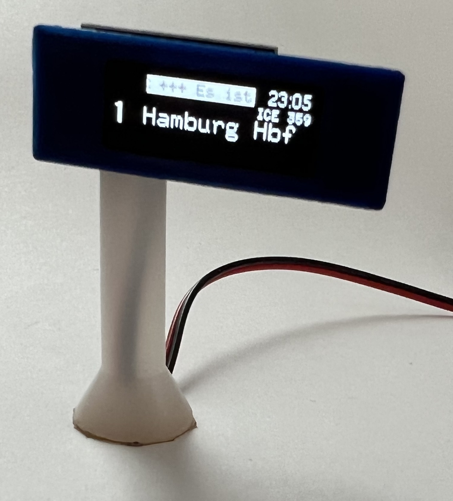
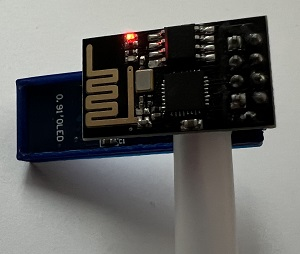

# Roc-MQTT-DisplayLT

Copyright (c) 2020-2022 Christian Heinrichs.
All rights reserved.

Dynamic Passenger Information system with **one** display for Model Railroad Stations controlled by Rocrail.
Wireless communication with Rocrail or other sources via MQTT messages.
An ESP8266-01 controller can drive one 0.91" 128x32 I2C OLED display. 
Several controllers can run in parallel so the total number of displays is not limited.

Latest Version 1.00 
January 04, 2022 

The goal of this project is to provide simple to use and inexpensive displays to run in a Model Railroad environment.

**Current features**  
- Messages can be static or dynamic
- Formatting is saved in templates so the user can focus on sending the right data to the display and just pick a template for formatting.
- The architecture is extremely scalable:
	* 1 display per ESP8266-01 based controller
	* Theoretically unlimited number of controllers in parallel (didn't have so many for testing :-) )
	* Up to 10 different Fonts
	* Up to 10 Templates
	* Up to 10 Logos
- Scrolltext for static or dynamic content
- Rocrail dynamic variables support
- German Umlaut support
- Clock/Date available for all displays (NTP time or Rocrail time)
- Display rotation
- Screensaver
- Tested with these displays: I2C Oled 128x32, 128x64, 64x48, 96x16
- Webinterface for configuration
- Updates via OTA

  
  

Architecture, Hard- and Software Requirements, Installation and Configuration are documented in the [**Wiki**](https://github.com/chrisweather/RocMQTTdisplay/wiki) of the main project.

Several more ideas and features are on the to do list.
Please share your experience and ideas for improvements via GitHub Issues function.

Thank you for your interest in the Roc-MQTT-DisplayLT project.
If you like the project please Star it here on GitHub and consider donating if you want to support further development.
Donations are more than welcome and I will use them to buy new displays, controllers and sensors for development and testing and of course for a lot of coffee... :-)

